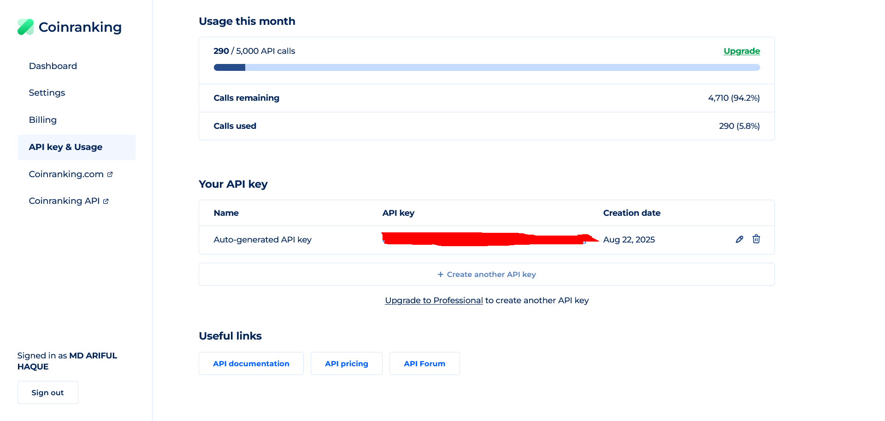

# Crypto Currency Price Tracker PHP Script
###### A Crypto Currency Price Tracker PHP Script allows users to monitor real-time cryptocurrency prices and market data through


## Overview
### Cryptocurrency Price Tracker
In recent years, cryptocurrency has evolved from a niche asset to a global investment phenomenon. With thousands of digital currencies now available on the market, staying informed about price movements is more critical than ever. A **Cryptocurrency Price Tracker** is a powerful tool that helps investors, traders, and enthusiasts monitor real-time price changes, market trends, and the performance of cryptocurrencies.

### What is a Cryptocurrency Price Tracker?
A cryptocurrency price tracker is an online tool or platform that provides real-time data on cryptocurrency prices, market capitalization, trading volume, and other critical metrics. These platforms aggregate data from various exchanges and display it in an easily understandable format, allowing users to track the value of cryptocurrencies like Bitcoin, Ethereum, and thousands of other altcoins.

### Why is a Cryptocurrency Price Tracker Important?
1. **Real-Time Price Monitoring** The cryptocurrency market is known for its volatility. Prices can fluctuate dramatically within minutes, making it essential for investors to monitor prices constantly. A price tracker provides live updates, ensuring that users have up-to-the-minute information to make timely decisions.
2. **Comprehensive Market Data** Apart from current prices, cryptocurrency price trackers also offer additional metrics like market capitalization, trading volume, historical data, and price charts. This information helps traders identify trends, evaluate market sentiment, and make data-driven investment decisions.
3. **Wide Range of Cryptocurrencies** With thousands of cryptocurrencies available in the market, keeping track of every coin can be daunting. Price trackers allow users to monitor not only popular cryptocurrencies like Bitcoin and Ethereum but also emerging altcoins. This makes it easier for investors to diversify their portfolios and spot new opportunities.
4. **Price Alerts and Notifications** Many cryptocurrency price trackers offer price alert features. These notifications let users know when a particular coin hits a specified price or when there are significant price movements. This is crucial for those who want to act quickly without constantly checking the market.
5. **User-Friendly Interface** Cryptocurrency price trackers are designed to be intuitive and user-friendly. Whether you're a seasoned trader or a beginner, these platforms allow you to easily access and interpret market data. The sleek design and simple navigation make tracking prices straightforward and efficient, even for those new to the crypto world.
### Key Features of a Cryptocurrency Price Tracker
1. **Real-Time Price Updates** Live price feeds for hundreds of cryptocurrencies, ensuring you have the latest data at your fingertips.
2. **Historical Price Charts** Access to historical data allows you to analyze the performance of different coins over time. Whether you're looking at the past week, month, or year, this feature helps with long-term investment strategies.
3. **Market Data Aggregation** A reliable price tracker aggregates data from multiple exchanges, providing the most accurate and up-to-date information available.
4. **Customizable Alerts** Set personalized alerts to get notified when a cryptocurrency reaches a target price or when there's significant price action.
5. **Multi-Currency and Multi-Timezone Support** Most trackers offer conversion between multiple fiat currencies, including USD, EUR, GBP, and others. This feature is especially useful for international investors.
6. **Cryptocurrency Comparison** Compare the performance of various cryptocurrencies side-by-side to evaluate their relative market positions and trends.
### How Cryptocurrency Price Trackers Benefit Investors
For investors, having access to accurate, real-time data is essential for maximizing profits and minimizing risks. A cryptocurrency price tracker provides several benefits:

- **Informed Decision-Making:** Armed with the latest data, investors can identify trends, make well-timed purchases, and avoid losses.
- **Market Monitoring:** Investors can keep an eye on the price movements of multiple cryptocurrencies, ensuring that they never miss an important shift in the market.
- **Risk Management:** With tools like price alerts, investors can manage their investments more effectively by acting quickly on price changes, thereby reducing exposure to market volatility.
### Conclusion
In the fast-paced and ever-changing world of cryptocurrency, a price tracker is an essential tool for anyone looking to stay ahead of the market. By offering real-time price updates, historical data, price alerts, and an easy-to-use interface, cryptocurrency price trackers provide valuable insights for investors of all levels. Whether you're a day trader, a long-term holder, or someone simply looking to monitor the market, these trackers are indispensable tools that help you navigate the volatile crypto space efficiently and effectively.
With the right cryptocurrency price tracker, you can make more informed decisions, spot trends early, and keep your portfolio aligned with the latest market shifts. Stay ahead of the game, and let a cryptocurrency price tracker be your guide in the ever-evolving world of digital assets. 


## Features

- **Real-Time Price Updates:** Get instant, live updates on cryptocurrency prices, ensuring you always have the most up-to-date information.
- **Comprehensive Market Data:** Track key metrics like market capitalization, trading volume, price changes, and market trends for all supported cryptocurrencies.
- **Wide Range of Cryptocurrencies:** Monitor prices for thousands of cryptocurrencies, including major coins like Bitcoin, Ethereum, and lesser-known altcoins.
- **Historical Price Charts:** Access detailed price charts and historical data to analyze market trends and make informed investment decisions.
- **Price Alerts and Notifications:** Set custom alerts to receive notifications when a cryptocurrency reaches a specific price or when there’s a significant price change.
- **Multi-Currency Support:** View cryptocurrency prices in different fiat currencies (USD, EUR, GBP, etc.) and compare them to find the best deals.
- **User-Friendly Interface:** Navigate easily with a clean, intuitive interface designed for both beginners and experienced traders.


## INSTALATION
1. [Clone](https://github.com/mah-shamim/crypto-currency-price-tracker-php-script.git) or [Download files](https://github.com/mah-shamim/crypto-currency-price-tracker-php-script/archive/refs/tags/v1.0.0.zip)
2. Unzip the downloaded files right through your Server/hosting Public_html folder.
3. Get your API key from https://account.coinranking.com/create-account by registering an account.
4. Rename admin/config.php.example to admin/config.php
```bash
cp admin/config.php.example admin/config.php
```
5. Open config.php and put your API Key of coinranking in between the double quotes of $apiKey= "api_key_here";
```php
<?php
$apiKey = "Add Your api key here";
```
6. Visit your website URL to see your website running.
“You can check the API usage by logging in to your account”
https://account.coinranking.com/dashboard/api
